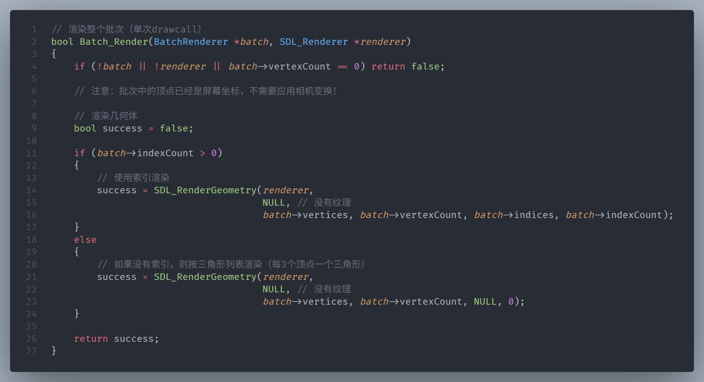
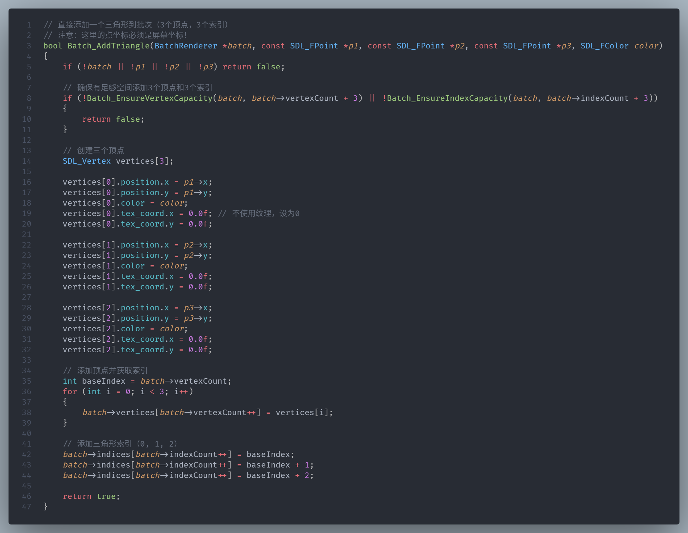
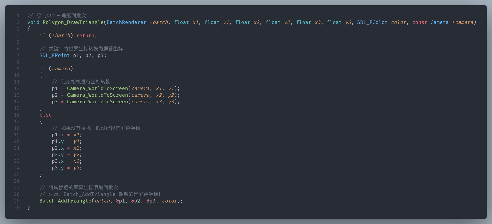
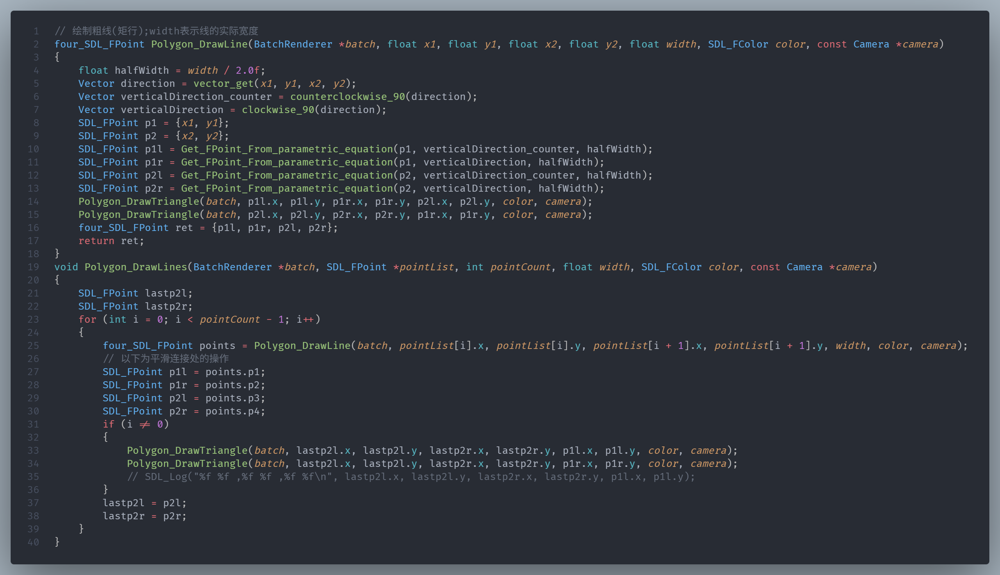
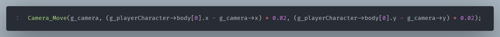
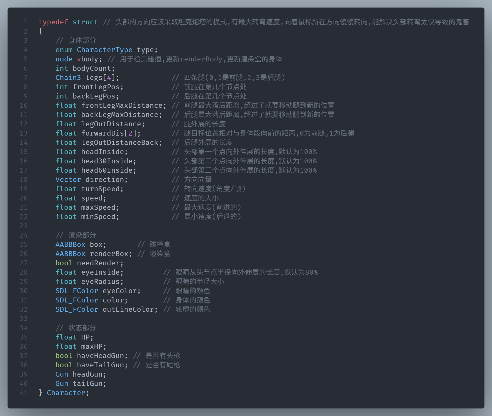
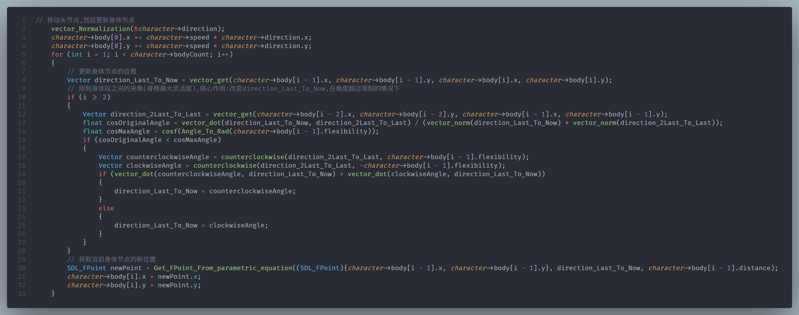
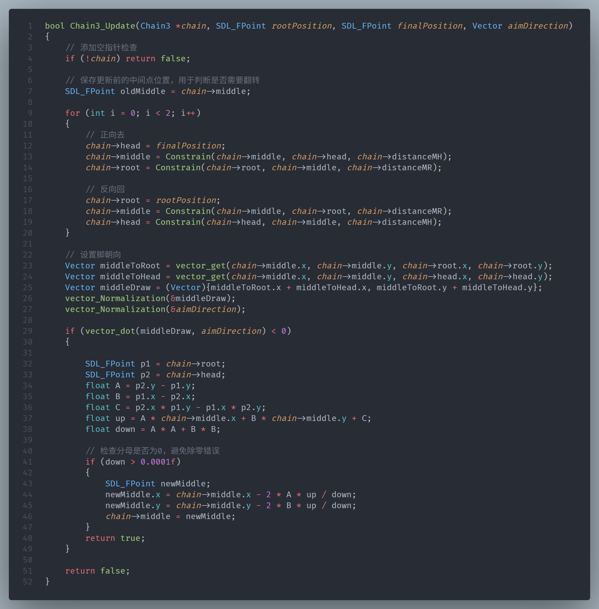
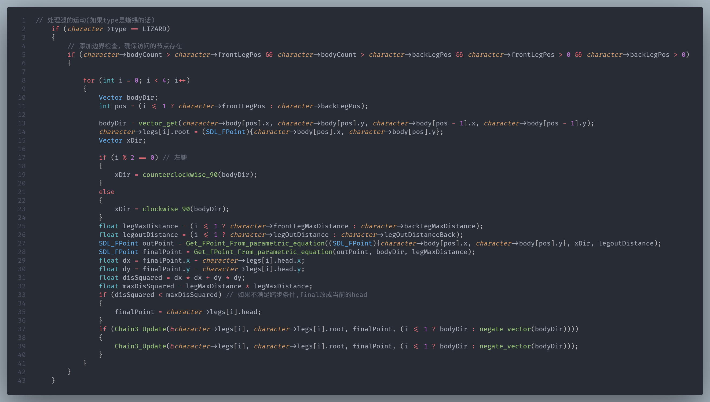
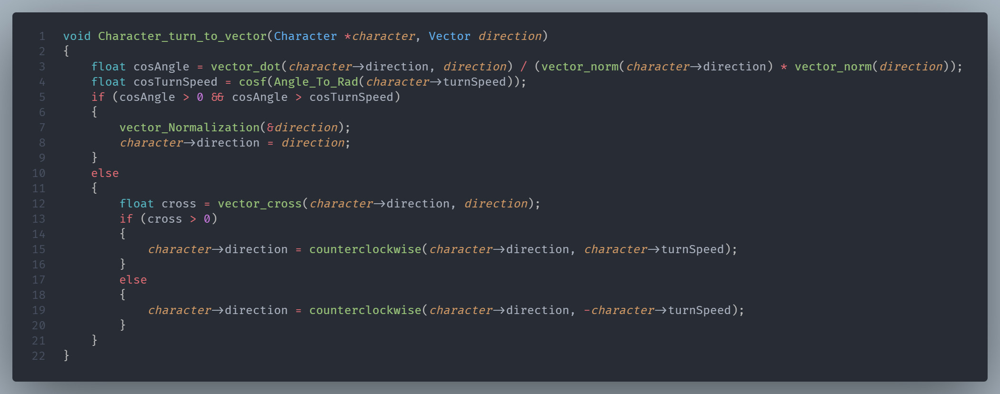

# STAY_ALIVE_LIZARD_a-_C_language_final_project
This is my C language final project from the first semester of my freshman year.

Below is the defense report

LIZRD报告

报告人:软工普通3班 ***

1.  **项目概览**

这个项目使用SDL图形库,从零几乎实现了一个小型2d游戏引擎;实现了带缩放的2d摄像机系统,自己封装了画简易几何图形的一些函数,并借助批渲染技术来提高渲染效率;所有游戏角色的运动和渲染都由程序化动画实现,在模拟腿部运动的部分使用了反向运动学;做了简易的碰撞检测优化;做了渲染剔除,在视口外的角色不进行渲染;做了一个比较准确的帧率控制系统,分离了逻辑和渲染,在保证运动速度不变的同时可以充分展现渲染的优化效果;游戏场景使用了基于回调函数的模式,便于管理和添加场景,不同场景逻辑清晰

1.  **技术实现**

**1.批渲染和简易几何图形绘制:**

~为什么要批渲染?---- GPU渲染图形(尤其是三角形)的速度是很快的,在渲染压力不大的时候拖延渲染速度的其实是drawcall,即CPU向GPU提交渲染命令;如果能把很多图形的渲染合成一个批次,只提交一次渲染命令,即进行一次drawcall,就能大大提高渲染效率.经过笔者测试,渲染同样数量的三角形,使用批渲染的帧数是不使用批渲染帧率的7倍(700多帧:100多帧);批渲染另一个功能是分离UI,游戏角色,背景物品的渲染,把他们分到不同的批次渲染,可以为不同的批次添加”滤镜”(不过本项目里面没有实现,用不上)

~如何实现批渲染----封装一个批渲染器的结构体,主要数据结构是存放顶点的数组(并借助其他函数实现动态长度),最核心的函数是Batch_AddTriangle(),向批次里面添加一个三角形, Batch_Render()实现渲染整个批次,把批次里面的所有顶点提交给SDL_RenderGeometry()函数,由于只调用了一次这个函数,所以只进行了一次drawcall

核心函数:

~如何实现几何图形绘制----其实是对SDL_RenderGeometry()的封装,实现对摄像机系统和批渲染的支持;核心函数是Polygon_DrawTriangle(),输入三角形的世界坐标,转换成窗口坐标,添加进批次;其它函数比如画凸多边形(三角形扇形法分割),画矩行,画圆,画线,画折线,都是画多个三角形来实现;画折线函数有个特殊的处理就是在两条线(实际上是矩行)的交界处画两个三角形来填充空隙,让线看起来真正连起来,效果更好

核心函数:

**2.摄像机系统:**

~为什么实现摄像机系统----角色只在屏幕中规定的区域内活动看着很拘束,也不好进行好玩的玩法

~如何实现摄像机系统----摄像机的思路是逻辑和渲染分离,渲染完全不干扰游戏的逻辑运行,摄像机的核心功能就是将世界坐标转换为屏幕坐标,设定相机的位置就是屏幕中心,公式是

screenPoint.x = (_worldX_ - _camera_\->x) \* _camera_\->zoom + _camera_\->screenWidth / 2.0f

screenPoint.y = (_camera_\->y - _worldY_) \* _camera_\->zoom + _camera_\->screenHeight / 2.0f

世界坐标是常见的笛卡尔坐标系,屏幕坐标系是以左上角为0点,向右为x正方,向下为y正方向

wordX-camera->x计算物体到计算机的相对坐标(平移),乘以缩放系数后(缩放系数>1表示放大,<1表示缩小),转换到屏幕上需要加半个屏幕宽度

Camera->y-wordY计算物体到计算机的相对坐标(平移), 乘以缩放系数后,转换到屏幕上需要加半个屏幕高度

为什么y和x的处理方式相反呢?

关键原因：屏幕 y 向下是正，世界 y 向上是正，两者方向相反

在世界坐标里：点在相机“上方”意味着 worldY > Camera->y

但在屏幕坐标里：点在屏幕“上方”意味着 screenY 更小（靠近 0）

所以我们希望：

如果 worldY 比 Camera->y 大（点在上方），那屏幕上的偏移应该是 负数（往上移动）

用 (Camera->y - worldY) 就能做到：worldY 越大，(Camera->y - worldY) 越负，screenY 就越小

~摄像机跟随玩家----通过平滑插值来平滑移动跟随玩家

相机每次向玩家位置移动一定距离,这个距离随着相机和玩家之间的位置变小也会跟着变小,达成平滑的效果

**3.UI:**对画几何图形函数的进一步封装,有独立的批次

**4.向量类:**实现一些向量的运算,辅助其它功能

**5.本项目的核心:角色:**核心思路--程序化动画和反向运动学

(1)逻辑部分:

~角色的数据结构----角色由多个节点组成,节点有各自的位置,半径,距离,灵活度,角色通过各个节点组合而成的”链条”模拟动物,各节点分别被上一个节点约束,各节点的灵活度即关节旋转的最大角度,符合现实中动物脊椎灵活度的设定

角色的结构体

~”链条”模拟实现(正向运动学)----通过参数方程,各节点分别被上一个节点约束在一定半径的圆上,头节点移动,其余节点会依次根据约束更新位置;关节灵敏度的实现:计算两段身体的夹角,如果超过最大夹角,就把它调整到最大夹角,这里使用了比较两个点积的大小来判断应该向哪个方向旋转(一个更好的办法是进行二维向量的叉积来判断向哪个方向旋转,这个在后面缓慢向一个方向旋转一个向量的函数里面有运用到)

~腿模拟实现(反向运动学)----本质上是一个三个节点的链条,使用FABRICK反向运动学算法(迭代两次效果就已经足够),使脚的位置不动,身体移动带动关节旋转,当脚落后于身体一定距离时更新脚的位置.不添加关节角度约束时关节可能会出现反曲的现象,于是检测关节的方向如果反向了(点积<0),就把中间节点对称过去,因为只有三个节点,于是这个简单的对称就可以限制关节的方向

~角色转向----敌人的简单AI就是持续面朝玩家移动:角色方向向量向目标向量缓慢旋转,通过判断这两个向量叉积的正负来判断角色方向向量需要顺时针还是逆时针旋转,然后在对应方向旋转即可(叉积>0表示要逆时针,<0表示要顺时针).

(2)渲染部分

~画身体----基本思路是通过参数方程,在每个身体节点取两个节点(头尾再多取一些点),然后通过Chaikin曲线算法来生成平滑点,使最后身体渲染效果更平滑.然后按照顺序画出组成身体的三角形.此外为了实现描边,按顺序记录渲染点,最后用画粗线函数画出描边即可

~画腿----类似于画身体,但是不再使用平滑算法,且在head节点画一个圆即可(简化渲染)

(3)角色池:动态申请内存存放所有角色的指针,在后面对角色的遍历都通过这个动态数组进行;在一个角色死亡删除角色时,先销毁要删除的角色,然后让i处的指针直接指向最后一个角色,然后把最后一个位置设为NULL,减少计数器;销毁然后交换位置,而不是把后面所有的角色都向前移(因为角色的顺序并不重要),这样复杂度只有O(1),减少了不必要的操作;

**6.碰撞检测:**

~主要涉及的碰撞

角色头部和自己身子以及其它角色的所有节点的碰撞检测----角色身子不重叠

子弹和所有角色的碰撞检测----子弹会打中自己,但伤害减少,打别的角色伤害正常

相机视口和角色AABB碰撞盒的碰撞检测----渲染剔除

~碰撞检测的优化----角色之间精细的碰撞检测是遍历所有节点,检测两圆碰撞,很多相距很远的角色不可能碰撞,也就不需要进行精细碰撞检测,于是在每个逻辑帧更新角色的AABB碰撞盒(下称碰撞盒),在所有的碰撞检测(角色自己头部和身子的碰撞检测,所有角色之间碰撞检测,所有子弹和角色的碰撞)时都先用碰撞盒粗检测,再进行精细检测(渲染剔除没有精细检测).

**7.移动:**角色有最大速度,按w键加速,松开后缓慢减速,ad键左右转向.通过直接控制摄像机移动时观察到,当使用普通的按键事件进行控制时,会先移动一下,然后延迟一小段时间后继续移动(因为当一个按键按下时,一个keydown消息立即进入事件列表,随后当保持按键按下状态一段时间后,才会有接连不断的keydown消息被触发);此外,事件系统和游戏主循环是异步的,可能一些逻辑帧内有多个keydown事件,而一些逻辑帧内没有keydown事件,会使移动速度不均匀.所以使用一个bool值来表示是否按下某按键,按下按键时设为true,松开时设为false,在逻辑帧内根据bool值来控制.

**8.帧率控制系统:**

每个逻辑帧计算帧间隔时间(dt),时间累积器添加dt,当时间累加器大于等于目标帧间隔时,减去目标帧间隔,然后添加需要更新逻辑帧的次数n,在主循环中,更新n次逻辑;这样确保了逻辑帧的恒定.

**9.游戏场景**\----基于回调函数的场景管理系统

(1)设计目标

~各个场景之间和各个场景的逻辑和渲染分离,代码结构清晰

~场景切换时自动管理资源生命周期,防止内存泄漏

~防止不同场景之间的状态污染

~可拓展性强,轻松添加新场景而不影响现有场景

(2)核心数据结构:场景结构体,主要存储场景的枚举和不同功能(初始化,事件处理,逻辑更新,渲染,场景清理)的回调函数的指针

(3)场景切换流程:

1.请求切换:调用ChangeScene()函数设置目标场景和切换标志

2:在SDL事件处理回调中:检测是否需要切换

3:清理旧场景:调用场景的cleanup()函数

4:初始化新场景:调用新场景的init()函数

(4)场景的逻辑和渲染:

在SDL的主循环回调SDL_AppIterate()中根据当前场景的枚举在数组中调用当前场景的逻辑和渲染回调函数;

**10.游戏性**

游戏的目标是操控蜥蜴,在蛇群的围攻下活下去,在蜥蜴的头和尾部都有枪,可以分别进行射击来杀死蛇,射出去的子弹自己碰到也会掉血;

共有三把枪,三种主要子弹,每隔一段时间跳出更改战备的选项,每次可以换子弹或枪,可以逐步选择适合的战备来增强战斗力.

子弹和角色的碰撞会先进行AABB碰撞盒(每帧角色生成好的,在别的地方也大量使用)的粗检测,再进行精细检测,提升了速度.

1.  **开发感想**

这个项目花了挺长时间的,但是学到了很多东西,提升了编码能力,提升了程序设计能力,学习了计算机图形学的很多知识,学习了游戏开发的一些知识,熟悉了SDL图形库的使用方法,进一步增强的使用AI的能力,包括使用AI查询资料,解决问题,辅助编码.

本项目的核心内容其实是受一个视频启发,[这个视频](https://www.bilibili.com/video/BV1DpWvzoEJb/?share_source=copy_web&vd_source=9cf53c673f2525d4e6b8ea3d85652459)展示了程序化动画生成蛇,鱼和蜥蜴,仅展示了思路,核心算法是正向动力学和反向动力学,我觉得这个很不错,就根据这个”程序化动画”的思路开始了这个项目.

在开发的过程中,我是优先带着优化的目的进行的,即进行底层函数架构的时候就选择效率最高的算法,比如批渲染.鉴于这个项目实际玩法的实现难度不大,没有必要快速写出原型,于是我前期都着重于渲染,摄像机系统,向量类,ui系统这些底层的东西,避免了之后底层设计得有问题需要重构代码的麻烦.

在实现角色的移动即模拟链条的过程中,根据那个视频的思路做了基础的约束,关节角度限制是自己琢磨出来的,实现难度不大;

一个实现难度挺大的是角色的渲染部分:因为只有画三角形的函数,画多边形函数也只支持凸多边形,而角色身子的形状是任意多边形,就只能一段一段地画身体.为了更平滑,还学习了柴金曲线算法,有了平滑点的加入,就更难了,起初写的效果很差,交给AI分析问题并提供代码,依旧不行,最后还是一步一步地细心地分出点,按特定顺序组织这些点为三角形画出来,这让我感到AI的处理图形化的能力还是不够完善;

另一个实现难度挺大的是腿部的运动模拟,使用了反向运动学,我选择了FABRIK算法(正向反向到达反向运动学),FABRIK算法的核心思想是通过迭代优化，逐步逼近问题的最优解。它将问题分解为一系列子问题，通过迭代求解子问题，最终得到整体问题的解。没有关节角度限制的FABRIK实现难度不大,但如果要添加关节角度限制(现实中动物的一些关节是不能反曲的),网上的资料都没有这方面的内容(后面我才明白,因为不好实现,而且需要这个功能可以使用更好的CCD),我只好查看[初始论文](https://www.sciencedirect.com/science/article/abs/pii/S1524070311000178)里面的角度限制部分,自己实现,但是以失败告终,最后我选择以简单的对称来实现控制关节弯曲的方向.

在实现动态数组的部分,给每个需要的类都单独设计了动态数组的一系列函数(有些是借助AI写的,但都理解了),因为自己写的通用的动态数组不太好用,并且不同的类的需求不同;通过动态数组的学习,我还学习到了内存方面的知识,学习了如何避免内存泄漏(尤其是存放动态申请了内存的类的指针时的内存管理).

AI方面,首先我认为我们要全面拥抱AI,在合理使用AI的前提下.下面是本项目我使用deepseek的对话列表(还有一些对话在vscode内的AI插件内)

经过这次项目的锻炼，在使用AI这方面我得到了很大的提升，我会给AI逻辑清晰的提示词，清楚地表明我的要求，好让AI生成的答案指向性更强，简单来说，就是更加会＂提问＂了．有的人说AI能让非专业人员也能写出好的代码，甚至有人说能替代程序员，但是我认为，程序员更清楚代码的原理，也更会＂提问＂，如果是非专业人员，给AI一些模棱两可的问题和要求，那AI也很难生成好的代码．AI时代要积极使用AI，但也要合理，能合理高效地使用AI对编码效果和效率有很大提升.

最后,不用游戏引擎做有一定逻辑和画面要求的游戏真的很难,但是这个这个制作的过程就是一次学习的过程,而且能学到非常非常多的东西,也是一次锻炼(建议以后c语言期末项目强制做图形化游戏,真的非常非常锻炼人 : ) ).还是要感谢以后自己要用的游戏引擎吧,自己做这么难,更能体会到游戏引擎的宝贵.
